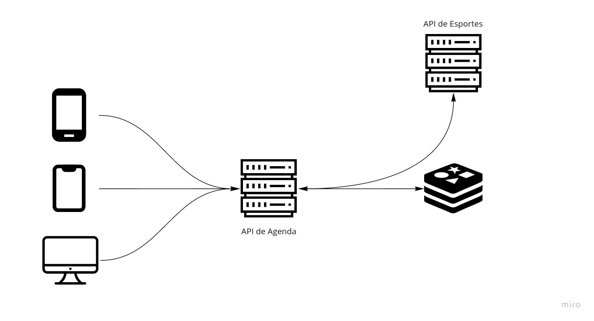

# Anotações 

  <a href="README.md">README</a>&nbsp;&nbsp;&nbsp;|&nbsp;&nbsp;&nbsp;
  <a href="CONFIG.md">CONFIG </a>&nbsp;&nbsp;&nbsp;|&nbsp;&nbsp;&nbsp;

## Brainstorm

Ao ler o desafio da primeira vez pensei em fazer um BFF utilizando GraphQL. Com GraphQL eu teria um endpoint que forneceria os conteúdos de acordo com cada request. Um endpoint serviria para iOS, Android e Web. Lendo um pouco mais o desafio percebi a grande necessidade de cache para o serviço de Agenda. A API de esportes pode ter uma resposta muito lenta e não está preparada para um grande carga. Acredito que adicionar uma camada de cache é muito importa. Atualmente estou pensando em cachear as respostas da esportes API e servir essas respostas cacheadas, principalmente os jogos antigos e os que ainda não aconteceram. Para os jogos em tempo real tenho que ver.

Rascunho da primeira arquitetura:

Refs: 
- https://samnewman.io/patterns/architectural/bff/
- https://thenewstack.io/bffs-developing-nprs-voice-user-interface-with-node-js/

## Lidando com a parte de jogos

Minha solução se baseia bastante no uso cache para conseguir reduzir o tempo na resposta e a carga no servidor da EsportsAPI. Para isso preciso fazer o controle de cache a depender da situação. No primeiro momento pensei em deixar três faixas separadas:

1. Jogos que já foram completados (passados): Cache de prazo maior, 12h ou mais.
2. Jogos que estão acontencendo: Cache de curto prazo, entre 1-5 minutos.
3. Jogos que acontecerão: Cache que expirará quando o jogo começar.

Possiveis soluções:
- CRON/Função que seta o cache da partida em andamento mais rápido do que o cache expira. Dessa forma sempre haverá cache para os clientes e as chamadas vão ser reduzidas. Elas serão feitas apenas pelo BFF.
- Também estou pensando uma forma de atualizar apenas o cache do jogo que está ocorrendo. A API de Esportes responde todos os jogos que irão ocorrer naquele dia
- Usar uma técnica parecida com Debounce. Caso não haja cache para jogos que estão acontecendo porém já foram feitas requisições tenha sido
- Possibilidade de usar fila 

## Adição de Circuit Breaker

Ao analisar o cenário descrito no [README](README.md), no qual pode haver o retorno de muitos erros em curto espaço de tempo. Lembrei de uma [palestra que vi sobre a votação do BBB](https://www.youtube.com/watch?v=byoQsLNESy8) e como implementaram o padrão Circuit Breaker. Pode ser uma boa para essa situação.

Dois links interessantes que encontrei foram esses:
- [Node.js Resiliency Concepts: The Circuit Breaker](https://blog.appsignal.com/2020/07/22/nodejs-resiliency-concepts-the-circuit-breaker.html)
- [CircuitBreaker](https://martinfowler.com/bliki/CircuitBreaker.html)